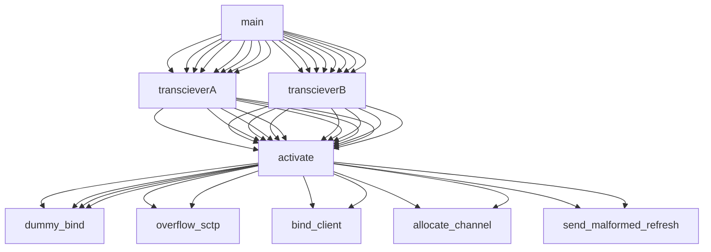

cve-20220-24852.cpp - demonsrate improper acess via dummy_bind function. with some modifications on the channel bind methods a  mitm on a channel is possible .Mitm functionality was removed from the code , blocking the improper access would also block the potential Mitm inferred from this code ... 

Flow : 

 
